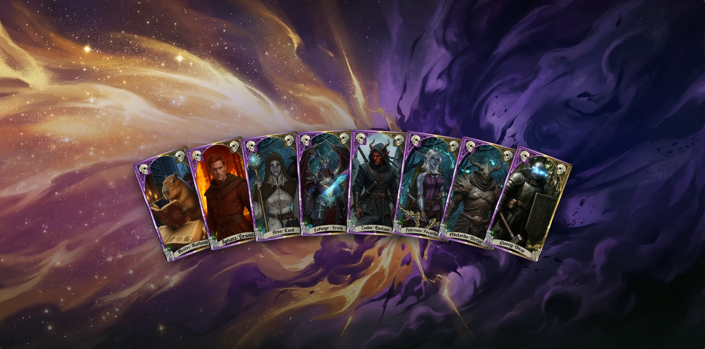
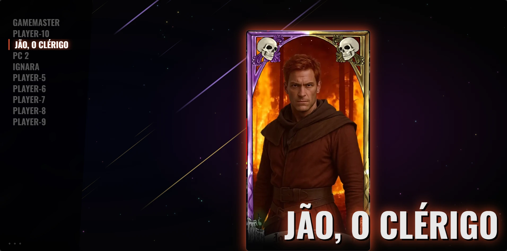

# Custom Login

Replace Foundry VTT's boring default login page with a **visual character screen** — your players click their portrait to join, no menus, no confusion.

---

## Why use this?

The default Foundry login page is a plain text form. This module replaces it with a full-screen experience designed for players who don't care about the technical side — they just want to click their character and play.

**Login Screen**
<p align="center">
  
</p>

<p align="center">
  
</p>

---

## What it does

- **Visual login** — Players see a beautiful screen with their character portrait. One click and they're in.
- **Password support** — Optionally require a password for specific players. The prompt appears right on the login screen.
- **Show/hide players** — Choose which characters appear on the screen. Hide the GM, hide inactive players.
- **7 layouts to choose from** — Pick the style that fits your game's mood (see below).
- **Custom background** — Set any image or video as the background. You can even use your world's existing background automatically.
- **Video background audio** — Optionally enable audio on video backgrounds, triggered on first user interaction.
- **Custom sounds** — Choose hover and join sound effects to give the screen a polished feel.
- **Custom title & favicon** — Set the browser tab title and icon so it looks like your own game portal.
- **Shareable link** — The module generates a single URL. Share it with your players and they're ready to go.
- **Multi-world support** — Works correctly when you run multiple worlds on the same Foundry server.
- **Reverse-proxy compatible** — URL generation works correctly when Foundry runs under a subpath (e.g. `yoursite.com/foundry`).
- **"No World Active" fallback** — If no world is running, players see a styled page instead of a broken screen.

---

## Layouts

| Layout | Aspect Ratio | Description |
|---|---|---|
| **Card Hand** | 9:16 | Characters arranged like cards in a hand |
| **Carousel** | 9:16 | Horizontal scrolling between portraits |
| **Portrait Row** | 9:16 | Players lined up in a row |
| **Sleek Phantom** | 9:16 | Minimal dark style; shows character attribute bars (HP, Stress, etc.) when supported by the system |
| **Photo Grid** | 1:1 | Gallery-style square portrait grid |
| **Solar System** | 1:1 | Portraits orbiting a center point |
| **Sidebar** | 1:1 | Glass panel on the left listing all players as rows |

> **Image tip:** 9:16 layouts expect portrait-oriented images. 1:1 layouts expect square images. See the [Image Format Guide](https://github.com/brunocalado/custom-login/wiki/Image-Format-Guide) for details.

---

## Setup (GM only — takes about 2 minutes)

1. Install the module and enable it in Foundry
2. Go to **Settings → Module Settings → Custom Login**
3. Click **Open Welcome Editor**
4. For each player, pick their portrait image, set a password if you want, and choose whether to show them on screen
5. (Optional) Click **Appearance** to set a layout, background, title, and favicon
6. (Optional) Click **Sounds** to configure hover and click audio
7. Click **Save and Close**
8. Copy the URL shown and share it with your players — that's it

---

## How players use it

1. Open the URL the GM shared in any browser
2. Click your character portrait
3. Enter your password if prompted
4. You're in

---

## Guides

[Image Format Guide](https://github.com/brunocalado/custom-login/wiki/Image-Format-Guide)

[Shortening the Login URL](https://github.com/brunocalado/custom-login/wiki/Shortening-the-Login-URL)

---

## Install

Paste this URL in Foundry's **Add-on Modules** installer:

```
https://raw.githubusercontent.com/brunocalado/custom-login/main/module.json
```

---

# 📜 Changelog

Full history of changes in the [CHANGELOG](CHANGELOG.md).

# ⚖️ License

* Code license at [LICENSE](LICENSE).
* https://pixabay.com/sound-effects/film-special-effects-game-start-317318/
* https://pixabay.com/sound-effects/technology-ui-tap-light-513023/
* [favicon.ico](https://game-icons.net/1x1/lorc/cultist.html)
```